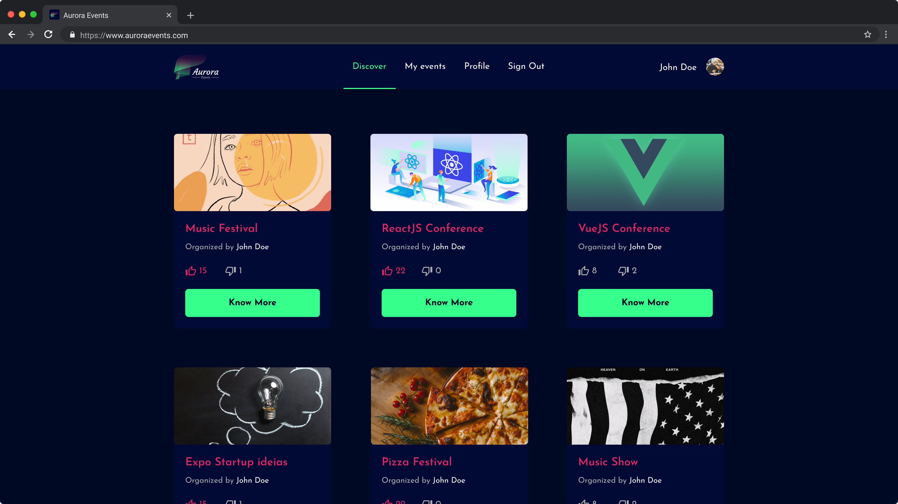

<h1 align="center">
  <br />
  
</h1>

<h4 align="center">Aurora events é uma plataforma de divulgação de eventos onde é possivel publicar e descobrir novos eventos incríveis.</h4>

<p align="center">
  
  
</p>

<p align="center">
  <a href="#instalação">Instalação</a>&nbsp;&nbsp;&nbsp;|&nbsp;&nbsp;&nbsp;
  <a href="#tecnologias">Tecnologias</a>&nbsp;&nbsp;&nbsp;|&nbsp;&nbsp;&nbsp;
  <a href="#licença">Licença</a>
</p>

<p align="center">
  
</p>

## Instalação

Para clonar e executar esta aplicação é necessário possuir instalado [Git](https://git-scm.com/) e [NodeJS](https://nodejs.org/en/download/) (que instala também o [npm](https://www.npmjs.com/)). Em sua linha de comando:

```bash
# Clone o repositório
$ git clone https://github.com/marcosribeirodacunha/aurora-events.git

# Entre no repositório
$ cd aurora-events

# Instale as dependências
$ npm install
// ou yarn

# Inicia a aplicação
$ npm start
// ou yarn start
```

### Importante

Para que todas as funcionalidades da aplicação funcionem normalmente clone, instale e inicie o servidor da API desta aplicação, que está localizada em: [aurora-events-api](https://github.com/marcosribeirodacunha/aurora-events-api).

## Tecnologias

- [ReactJS](https://pt-br.reactjs.org/)
- [Typescript](https://www.typescriptlang.org/)
- [React-Router](https://reactrouter.com/web/guides/quick-start)
- [Styled Components](https://styled-components.com/)
- [React Icons](https://react-icons.github.io/react-icons/)
- [Axios](https://github.com/axios/axios)
- [Create React App](https://github.com/facebook/create-react-app)
- [ESlint](https://eslint.org/)
- [Prettier](https://prettier.io/)
- [EditorConfig](https://editorconfig.org/)

## Licença

Esse projeto está sob a licença MIT. Veja o arquivo [LICENSE](LICENSE) para mais detalhes.
